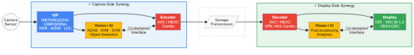

  <h1 align="center">BTree Inc. (비트리)</h1>
  

    <strong>End-to-End Video Pipeline IP — From Pixel to Display</strong>
  

  

    <a href="https://www.btree.co.kr">Website</a> &middot;
    <a href="http://en.btree.co.kr">English</a> &middot;
    <a href="README_kr.md">한국어</a>
  

---

## About Us

**BTree** is a semiconductor IP design company founded in 2014, headquartered in Seongnam (Bundang), South Korea. We design high-performance, low-power IP cores for the complete video signal chain — spanning **image capture, vision processing, video compression, and display output**.

Unlike vendors that specialize in a single stage, BTree delivers **synergy across the entire video pipeline**, enabling our customers to build tightly integrated SoCs with consistent quality, optimized latency, and reduced silicon area.

## Core Technology

  

The diagram highlights two key synergy zones:

- **Capture-Side Synergy** — ISP + Vision/AI + Encoder share co-designed interfaces, eliminating redundant format conversions and maximizing compression efficiency with ISP-aware encoding.
- **Display-Side Synergy** — Decoder + Vision/AI + Display share co-designed interfaces, enabling optimized post-processing and direct-to-panel delivery with integrated VDC-M/DSC compression.

### 1. ISP (Image Signal Processor)

Our flagship **METASEQUOIA** ISP IP handles the critical first stage of the video pipeline — converting raw sensor data into high-quality images.

| Feature | Specification |
|---|---|
| Resolution | Up to **13MP @ 60fps** (single instance) |
| Multi-instance | Up to **4 simultaneous inputs** |
| Bayer Input | 8 / 10 / 12 / 14-bit RAW |
| Output Format | YUV420, YUV422, YUV444, RGB888 |
| Interface | DVP, AXI |
| Key Functions | HDR, 3D Noise Reduction (3DNR), Lens Distortion Correction (LDC), De-warping, Scaling |

### 2. Vision & AI Processing

BTree's vision IP bridges the gap between image capture and intelligent scene understanding, targeting:

- **Automotive** — Around View Monitoring (AVM), Surround View (SVM), ADAS, Dash Cameras
- **Surveillance** — Real-time monitoring and analytics
- **Edge AI** — On-device inference with optimized preprocessing from our ISP stage

By co-designing vision algorithms alongside our ISP, we ensure **zero-loss handoff** between capture and processing — no redundant format conversions, no wasted bandwidth.

### 3. Video Codec

Efficient compression is essential for transmitting and storing the high-resolution streams our ISP produces. BTree's codec IP portfolio covers major industry standards:

- **AVC/HEVC Combo Encoder** — H.264 + H.265 unified encoder IP (in development)
- **AVC/HEVC/VP9/AV1 Combo Decoder** — Multi-standard decoder supporting all major codecs (in development)

Our codec IP is co-designed with the upstream ISP and downstream display stages, minimizing latency while preserving visual fidelity across the full encode-decode chain.

### 4. Display (DDI)

The final stage — BTree's **Display Driver IC (DDI) IP** delivers processed frames to panels with precision:

- Display Driver Interface IP optimized for mobile and automotive panels
- **VDC-M 1.2 Encoder/Decoder** — VESA Display Compression-M compliant, visually lossless up to **5:1 compression ratio (6 bpp)**
- **VESA DSC (Display Stream Compression)** — Standard panel-link compression for bandwidth reduction
- Co-optimized with our codec stage to minimize end-to-end latency

## The Pipeline Synergy Advantage

Most IP vendors offer point solutions. BTree's differentiation lies in **cross-stage optimization**:

| Challenge | Point Solution | BTree Pipeline Approach |
|---|---|---|
| ISP-to-Vision handoff | Format conversion overhead | Native format passthrough, co-designed interfaces |
| Compression artifacts | Generic codec tuned for natural images | Codec aware of ISP output characteristics |
| Display bandwidth | Separate compression at display link | VDC-M/DSC integrated into DDI, unified compression strategy |
| Multi-camera systems | Independent per-camera processing | Shared ISP + Vision pipeline with multi-instance support |
| Total silicon area | Sum of individual IP blocks | Shared buffers, unified control, reduced gate count |

When a single team designs the entire chain — **ISP, Vision, Codec, and Display** — every interface is an optimization opportunity, not a compatibility problem.

## Key Milestones

- **2014** — Founded in Seongnam, South Korea
- **2016** — Began QRNG chipset co-development with SK Telecom and ID Quantique
- **2020** — World's first **Quantum Random Number Generator (QRNG)** chip commercialized in Samsung Galaxy A Quantum
- **2024** — 10th anniversary; participation in IP-SoC Korea; KOSDAQ IPO preparation

## Business Model

BTree provides **software-based IP** that does not require per-process silicon re-verification by customers. This translates to:

- **Lower integration cost** for fabless customers and design houses
- **Process portability** across foundry nodes
- **Recurring royalty revenue** tied to customer shipments

## Contact

- **Website**: [btree.co.kr](https://www.btree.co.kr)
- **English**: [en.btree.co.kr](http://en.btree.co.kr)
- **Location**: Bundang-gu, Seongnam-si, Gyeonggi-do, South Korea

---

© 2024 BTree Inc. All rights reserved.
